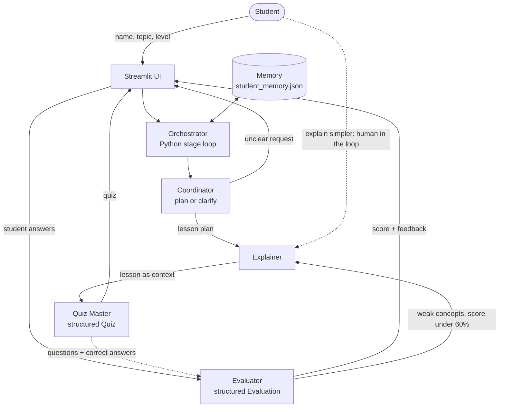

# 🦁 Leo: Multi-Agent AI Tutor

Leo is a study assistant built from four collaborating AI agents. A student picks a topic, and Leo's agents plan the lesson, teach it, quiz the student, and give personalised feedback. Weak answers are sent back for re-teaching. Each agent has its own role, prompt template, and behaviour, and they pass work to each other through real handoffs.

Built with **CrewAI**, **Pydantic**, and **Streamlit**, running on **gpt-oss-120b via Groq**.

📹 **Demo video:** `<add your link here>`

---

## Table of Contents

1. [Features](#features)
2. [The Agents](#the-agents)
3. [Architecture](#architecture)
4. [Orchestration Pattern](#orchestration-pattern)
5. [Handoffs](#handoffs)
6. [Memory](#memory)
7. [Prompt Templates](#prompt-templates)
8. [Structured Output](#structured-output)
9. [Error Handling](#error-handling)
10. [Bonus Features](#bonus-features)
11. [Project Structure](#project-structure)
12. [Getting Started](#getting-started)
13. [Usage Walkthrough](#usage-walkthrough)
14. [Troubleshooting](#troubleshooting)
15. [Limitations](#limitations)

---

## Features

- Four distinct agents: Coordinator, Explainer, Quiz Master, Evaluator
- Real handoffs between agents (lesson → quiz → evaluation → re-teaching)
- Structured, validated output using Pydantic models
- Persistent student memory (past topics, scores, weak concepts)
- One prompt template per role
- Graceful handling of vague requests, stalls, and malformed output
- Streamlit UI showing which agent is working and what it is doing
- **Bonus:** feedback loop (weak answers are re-taught) and human-in-the-loop controls

---

## The Agents

| Agent | Role | Behaviour | Input → Output |
|---|---|---|---|
| 🧭 **Coordinator** | Manager of the team | Brief and decisive. Checks whether the request is clear, asks one clarifying question if not, and otherwise writes a lesson plan using the student's history. Never teaches. | Name, topic, level, memory → `Plan` (structured) |
| 👩‍🏫 **Explainer** | Teacher | Patient and friendly, uses analogies and everyday examples. Lesson capped at about 300 words with key takeaways. Can re-teach from a new angle. | `Plan` (+ weak concepts on re-teach) → Markdown lesson |
| ❓ **Quiz Master** | Examiner | Playful but precise. Writes 4-option multiple-choice questions based only on the lesson it received. | Lesson (as context) → `Quiz` (structured) |
| 📝 **Evaluator** | Mentor | Fair and encouraging. Explains why answers are right or wrong and identifies weak concepts. | Questions + student answers → `Evaluation` (structured) |

---

## Architecture



**Session flow**

1. The student enters a name, topic, and level.
2. The Coordinator validates the request and produces a lesson plan.
3. The Explainer teaches; the Quiz Master turns that lesson into a quiz.
4. The student answers in the UI.
5. The Evaluator grades the answers and reports weak concepts.
6. If the score is below 60%, weak concepts go back to the Explainer for re-teaching, followed by a short new quiz.

---

## Orchestration Pattern

Leo uses **sequential, stage-based orchestration**. Each stage is a small CrewAI crew running with `Process.sequential`, and a Python orchestrator (`orchestrator.py`) controls the loop between stages:

| Stage | Crew | Agents |
|---|---|---|
| Plan | Planning crew | Coordinator |
| Teach | Lesson crew | Explainer → Quiz Master |
| *(student answers)* | Human input in the UI | — |
| Grade | Grading crew | Evaluator |
| Re-teach (optional) | Lesson crew with `focus` | Explainer → Quiz Master |

**Why not a single hierarchical crew?** A crew normally runs from start to finish in one call, but a tutor must pause for the student's answers. Splitting the work into stages lets the student sit between the Quiz Master and the Evaluator. Sequential crews are also more predictable than manager-delegated ones on free-tier LLMs. The Coordinator still acts as the manager: it plans first, and the orchestrator routes failures and re-teaching decisions through it.

---

## Handoffs

| From → To | Mechanism | What is passed |
|---|---|---|
| Coordinator → Explainer | `Plan` object fed into the explain task | Topic, level, subtopics, teaching notes |
| Explainer → Quiz Master | CrewAI task `context=[explain_task]` | The full lesson |
| Quiz Master → Evaluator | Orchestrator builds the grading prompt | Questions, correct answers, concepts, student's choices |
| Evaluator → Explainer | `teach(focus=weak_concepts)` | Weak concepts to re-teach from a new angle |
| Evaluator → Memory | `memory.record_session()` | Score and weak concepts |

---

## Memory

- **Short-term:** task context passes results between agents within a stage.
- **Persistent:** `memory.py` stores a student profile in `student_memory.json`: name, past sessions (topic, score), and weak concepts. The profile summary is injected into the Coordinator, Explainer, and Evaluator prompts, so Leo can say things like "this student struggled with X before". The sidebar shows the current memory summary.

The memory file is git-ignored because it contains personal study data.

---

## Prompt Templates

All templates live in `prompts.py`, one set per role (goal, backstory, task, expected output). Placeholders such as `{name}`, `{topic}`, `{level}`, `{profile}`, `{subtopics}`, and `{extra}` are filled in at runtime. Each role has a different tone and constraints, for example the Explainer's 300-word cap and the Quiz Master's "exactly N questions, 4 options each".

---

## Structured Output

Pydantic models in `schemas.py` are enforced through CrewAI's `output_pydantic`:

- `Plan`: `is_clear`, `clarifying_question`, `topic`, `level`, `subtopics`, `teaching_notes`
- `Quiz` / `Question`: `id`, `question`, `options` (4), `correct_index`, `concept`
- `Evaluation` / `QuestionResult`: per-question `is_correct` and `feedback`, `overall_feedback`, `weak_concepts`

The orchestrator re-validates the quiz (exactly 4 options, valid `correct_index`) before showing it. Correctness is computed in Python, not by the LLM, so a mis-marked answer can never affect the score.

---

## Error Handling

The Coordinator and orchestrator manage problems so the student never sees a crash:

- **Unclear request:** vague input ("help me", "stuff") is caught before any LLM call, and the Coordinator asks a clarifying question.
- **Stalls:** agents have `max_iter` and `max_execution_time` limits.
- **Bad or invalid output:** each stage is validated and retried up to 2 times with a fresh crew.
- **Fallbacks:** if planning fails, a simple default plan is used. If the Evaluator fails, a basic score-based review is shown.
- **UI:** failures surface as friendly messages, and every status message is logged in the activity panel.

---

## Bonus Features

- **Feedback loop:** if the score is under 60%, the Evaluator's weak concepts go back to the Explainer, who re-teaches only those ideas from a new angle. A short new quiz follows. The loop is capped at 2 rounds.
- **Human-in-the-loop:** at any point in the lesson the student can click **"Not clear, explain it simpler"**, which re-runs the Explainer and Quiz Master with a simpler teaching style.

---

## Project Structure

```
leo/
├── app.py             # Streamlit UI and session state
├── orchestrator.py    # Stage loop, retries, validation, feedback loop
├── agents.py          # The four agent definitions
├── tasks.py           # Task definitions and handoffs
├── prompts.py         # Prompt templates per role
├── schemas.py         # Pydantic models for structured output
├── memory.py          # Persistent student profile (JSON)
├── llm.py             # LLM configuration (Groq via OpenAI-compatible API)
├── cli_test.py        # Command-line smoke test of the backend
├── requirements.txt
├── .env.example       # Template for environment variables
└── README.md
```

---

## Getting Started

### Prerequisites

- Python 3.10 – 3.13
- A free [Groq API key](https://console.groq.com)

### Installation

```bash
git clone <your-repo-url>
cd leo

python -m venv venv
source venv/bin/activate        # Windows: venv\Scripts\activate

pip install -r requirements.txt
```

### Configuration

Copy the example environment file and add your key:

```bash
cp .env.example .env
```

Edit `.env`:

```
LEO_MODEL=openai/openai/gpt-oss-120b
LEO_BASE_URL=https://api.groq.com/openai/v1
GROQ_API_KEY=your_groq_key_here
```

> The model string has `openai/` twice on purpose. CrewAI strips the first one (the provider prefix), and the second is part of Groq's model ID (`openai/gpt-oss-120b`). The base URL sends requests to Groq instead of OpenAI.

`.env` is git-ignored. Never commit your API key.

### Verify the connection

```bash
python -c "from llm import get_llm; print(get_llm().call('Say hi in 5 words'))"
```

### Run

**Command-line test** (backend only):

```bash
python cli_test.py
```

**Web app:**

```bash
streamlit run app.py
```

---

## Usage Walkthrough

1. Enter your **name**, a **topic** (e.g. "Python decorators"), and your **level** in the sidebar, then click **Start learning**.
2. Watch the **activity log**: the Coordinator plans, the Explainer teaches, the Quiz Master writes the quiz.
3. Read the lesson. Click **"Not clear, explain it simpler"** if needed.
4. Answer the quiz and click **Submit answers**.
5. The Evaluator shows your score, per-question feedback, and weak concepts.
6. If your score is low, click **"Re-teach my weak areas"** to start the feedback loop.
7. Come back later with the same name and Leo will remember your history.

---

## Troubleshooting

| Problem | Likely cause and fix |
|---|---|
| `OPENAI_API_KEY is required` | The model string is routing to native OpenAI. Use the `.env` values above and make sure `base_url` and `api_key` are set in `llm.py`. |
| `model not found` (404) | Check the exact ID at [console.groq.com/docs/models](https://console.groq.com/docs/models) and keep the double `openai/` prefix. |
| `401 Unauthorized` | Invalid or mistyped Groq key. Regenerate it. |
| `429 / rate limit` | Free-tier limits. Wait a minute or reduce the number of quiz questions. |
| Repeated "invalid quiz" messages | The model failed to produce valid structured output. Retry, or try another model. |

---

## Limitations

- Free-tier API rate limits can slow or interrupt sessions.
- Quiz quality depends on the underlying LLM.
- Memory is a local JSON file, which suits a single user and not a multi-user deployment.
- The activity log shows stage-level messages, not each agent's internal reasoning.

---

## Tech Stack

[CrewAI](https://docs.crewai.com) · [Streamlit](https://streamlit.io) · [Pydantic](https://docs.pydantic.dev) · [Groq](https://groq.com) (gpt-oss-120b) · python-dotenv

---

## License

Add your preferred license here (e.g. MIT) or remove this section.

## Author

Your Name · `<your GitHub / email>`
